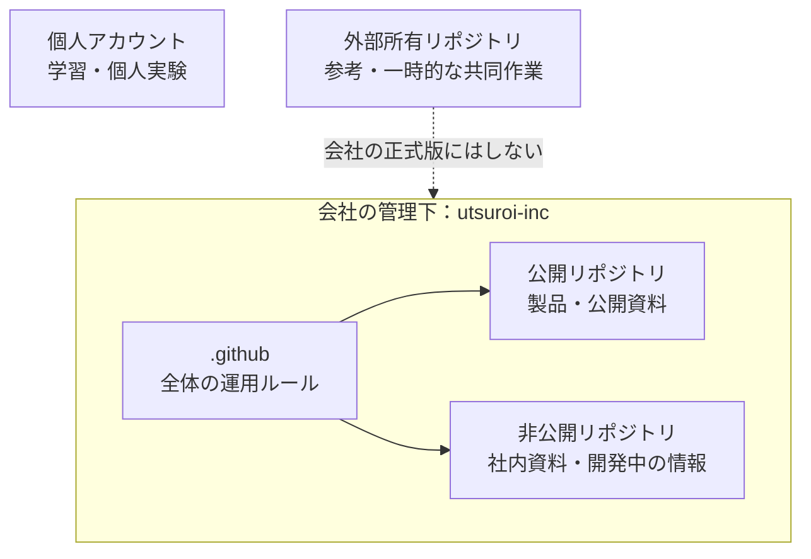
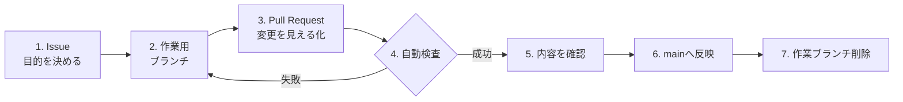

# 株式会社うつろい GitHub運用方針

## 1. この運用の目的

GitHubを単なるファイル置き場ではなく、会社の成果物と判断の履歴を安全に残す場所として使います。

この運用で実現したいことは3つです。

1. **会社の資産を会社の管理下に置く**
   担当者の個人アカウントや外部の人のアカウントだけに、会社の正式版を置きません。
2. **間違いを正式版へ入れる前に気づく**
   変更内容をPull Requestにし、自動検査を通してから反映します。
3. **「なぜ変えたか」を後から分かるようにする**
   IssueとPull Requestに目的・変更内容・確認結果を残します。

## 2. 全体像

### 置き場所の判断

| 内容 | 置き場所 | 公開範囲 |
|---|---|---|
| 会社の製品・業務ツール | `utsuroi-inc` | 内容に応じてPublicまたはPrivate |
| 社内マニュアル・顧客案件 | `utsuroi-inc` | 原則Private |
| 公開する研究成果・サンプル | `utsuroi-inc` | 公開前確認後にPublic |
| 個人の学習・会社と無関係な実験 | 個人アカウント | 本人が判断 |
| 外部の人が所有するリポジトリ | 外部アカウント | 会社の唯一の正式版にはしない |

公開か迷った場合は、まずPrivateで作ります。後からPublicへ変更できます。

## 3. 変更が正式版になるまで

### それぞれの意味

- **Issue**：やりたいこと、困りごと、完了条件を書く作業メモ
- **作業用ブランチ**：正式版を壊さずに変更するための作業場所
- **Pull Request**：何を、なぜ変えたかを確認する場所
- **自動検査**：ビルドや最低限の確認をGitHubが自動で行う仕組み
- **main**：現在利用できる正式版

## 4. 守るルール

1. `main`へ直接変更を入れず、Pull Requestを使う
2. 自動検査があるリポジトリでは、合格してから反映する
3. Pull Requestに「目的」「変更内容」「確認方法」を書く
4. 作業が終わったブランチは削除する
5. パスワード、APIキー、個人情報、顧客データをコミットしない
6. 公開範囲を変更するときは、内容を見直してから実行する

小さな誤字修正はIssueを省略して構いません。ただし、Pull Requestには目的を一文残します。

## 5. 完了の基準

次を満たしたら作業完了です。

- 目的に対する変更が完了している
- 自動検査が成功している、または手動確認の結果が記録されている
- READMEや使い方が古くなっていない
- 秘密情報や不要な個人情報が含まれていない
- Pull Requestがmainへ反映され、作業ブランチが削除されている

## 6. 新しいリポジトリを作るとき

1. 会社の仕事ならOwnerを`utsuroi-inc`にする
2. 公開する明確な理由がなければPrivateにする
3. READMEに「目的・利用者・使い方・管理者」を書く
4. コードがある場合は、ビルドまたはテストの自動検査を追加する
5. mainをPull Request経由にする
6. 実データや認証情報を入れず、サンプルデータを使う

## 7. 例外と緊急対応

障害対応などで通常手順を使えない場合は、Organization管理者が最小限の変更を行います。対応後にIssueまたはPull Requestへ、理由・変更内容・確認結果を記録します。

仕組み上main保護を強制できないリポジトリでも、同じ手順を人の運用として守ります。

## 8. 定期確認

- **作業のたび**：IssueとPull Requestの目的・確認結果を残す
- **月1回**：放置されたIssue、失敗中の自動検査、公開範囲を確認する
- **半年に1回**：使っていないリポジトリをArchiveするか判断する

ルールを増やすことが目的ではありません。迷い・事故・属人化を減らすために、必要な範囲だけ更新します。
