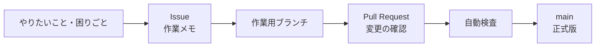
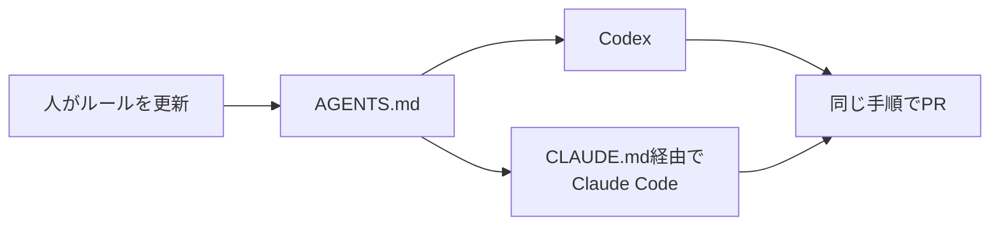

# 株式会社うつろい GitHub運用ガイド

このリポジトリは、株式会社うつろいのGitHub全体に共通する「取扱説明書」です。

目的は、難しいルールを増やすことではありません。会社の成果物を安全に保管し、変更の理由を後からたどれ、誰でも同じ手順で改善できる状態をつくることです。

## まず読むもの

1. [GitHub運用方針](GOVERNANCE.md) — なぜこの運用をするのか、全体像
2. [変更の進め方](CONTRIBUTING.md) — 実際の作業手順
3. [セキュリティ上の問題を見つけたとき](SECURITY.md) — 公開Issueへ書いてはいけない内容
4. [AI開発支援ツール向けルール](AGENTS.md) — CodexやClaude Codeが作業前に読む注意事項

## 一言でいうと

- 会社の仕事は `utsuroi-inc` に置く
- `main` は正式版として扱い、直接変更しない
- 変更はPull Requestにして、目的と確認結果を残す
- 社内情報・顧客情報・秘密情報は公開リポジトリへ置かない

## AIにルールを伝える仕組み

Organization共通の考え方はこのリポジトリ、製品固有のコマンドや禁止事項は
各リポジトリ直下の `AGENTS.md` に置きます。`CLAUDE.md` は `AGENTS.md` を読み込む
短い入口にし、同じルールを二重管理しません。

Organizationの公開プロフィールは [`profile/README.md`](profile/README.md) で管理しています。
